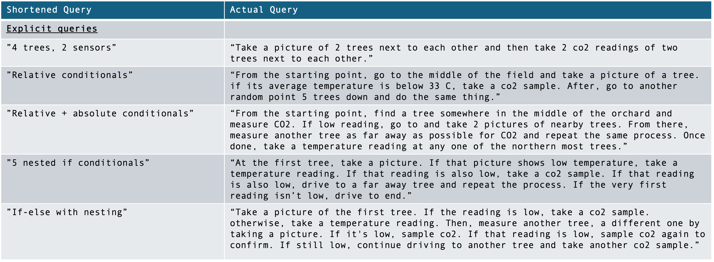
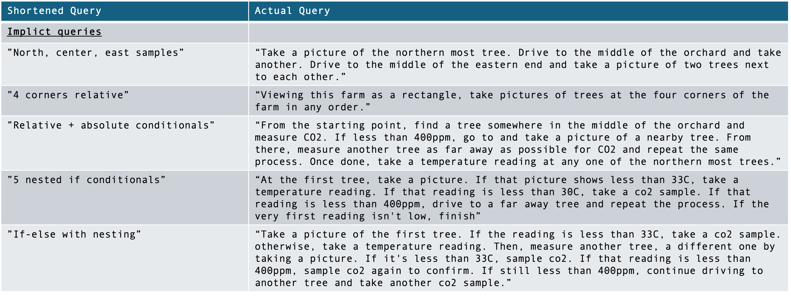
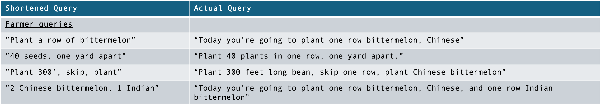

# GPT-Powered Robot Mission Planner
[](https://github.com/ucmercedrobotics)
[](https://robotics.ucmerced.edu/)
[](https://www.python.org)
[](https://github.com/pre-commit/pre-commit)
[](https://github.com/psf/black)
<!-- [](http://mypy-lang.org/) -->
<!-- TODO: work to enable pydocstyle -->
<!-- [](http://www.pydocstyle.org/en/stable/) -->

<!-- [](https://arxiv.org/abs/2409.04653) -->

## How To Run GPT Mission Planner
https://github.com/user-attachments/assets/cd18a3b1-1cd3-48e9-ae74-825cca88b508

### GPT Token
Create a `.env` file and add your API tokens:
```bash
OPENAI_API_KEY=<my_token_here>
ANTHROPIC_API_KEY=<my_token_here>
```

### Docker

On ARM Macs, SPOT will be built from source. If necessary, you can force building SPOT from source on x86/64 by running `make build-image BUILD_SPOT=true`.

```bash
make build-image
```

```bash
make bash
```

The above two commands will start the build and bash process of the Docker environment to execute your GPT Mission Planner.

### Example Execution:
```bash
make build-image
...

make bash
make run
```

```bash
```bash
make server
```

### Web UI (Local)
Run the web interface in Docker (default http://localhost:8002):

```bash
make serve
```

If you want a different port:

```bash
WEB_PORT=8080 make serve
```

To test mission delivery locally, open another terminal and listen on the mission port (default 12346):

```bash
make server
```

### TCP Message Format
The output of this planner is as follows:

| Order | Field | Type/Size | Description |
| --- | --- | --- | --- |
| 1 | `xml_length` | 4 bytes (uint32, big-endian) | Length of the XML payload in bytes |
| 2 | `xml_payload` | `xml_length` bytes | Raw XML file bytes |
| 3 (optional) | `json_length` | 4 bytes (uint32, big-endian) | Length of the JSON payload in bytes (tree points) |
| 4 (optional) | `json_payload` | `json_length` bytes | UTF-8 JSON array of tree-point dictionaries |

Notes:
- If no tree points are sent, only fields 1–2 are transmitted and the socket closes.
- The receiver detects absence of JSON by `recv` returning empty when attempting the next 4-byte length.
- JSON is UTF-8; XML is sent as raw bytes.

## Test
```bash
python -m pytest test/ -v
...
test/test_network_interface.py::test_send_xml_only PASSED [25%]
test/test_network_interface.py::test_send_xml_and_tree_points PASSED [50%]
test/test_network_interface.py::test_length_prefix_correctness PASSED [75%]
test/test_network_interface.py::test_empty_tree_points_list PASSED [100%]
...
```

## Example Queries
The following queries are used to demonstrate the capabilities of this system:







## Citation
If you use this work, please cite:

```latex
@inproceedings{zuzuarregui_carpin_2025,
	author    = {M. A. Zuzu\'{a}rregui and S. Carpin},
	title     = {Leveraging LLMs for Mission Planning in Precision Agriculture},
	booktitle = {Proceedings of the IEEE International Conference on Robotics and Automation},
	pages     = {7146--7152},
	year      = {2025}
}
```
