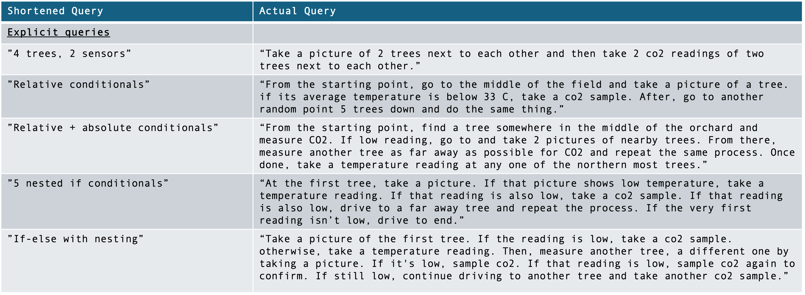
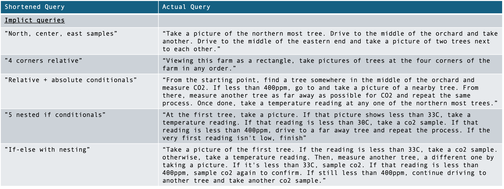
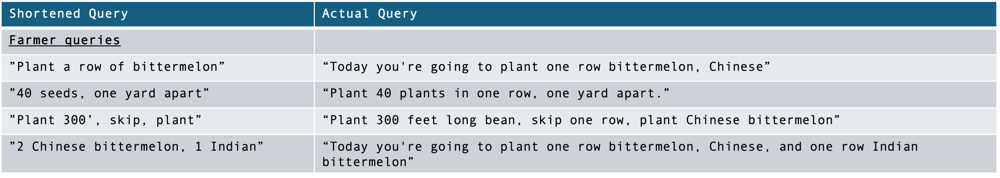

# GPT-Powered Robot Mission Planner
[](https://github.com/ucmercedrobotics)
[](https://robotics.ucmerced.edu/)
[](https://www.python.org)
[](https://github.com/pre-commit/pre-commit)
[](https://github.com/psf/black)
<!-- [](http://mypy-lang.org/) -->
<!-- TODO: work to enable pydocstyle -->
<!-- [](http://www.pydocstyle.org/en/stable/) -->

<!-- [](https://arxiv.org/abs/2409.04653) -->

## How To Run GPT Mission Planner
https://github.com/user-attachments/assets/cd18a3b1-1cd3-48e9-ae74-825cca88b508

### ENV Variables
Create a `.env` file and add your API tokens:
```bash
OPENAI_API_KEY=<my_token_here>
ANTHROPIC_API_KEY=<my_token_here>
```
By default, XML planning uses OpenAI and is the only key required.
If using formal verification, add an Anthropic key.

You may also configure the speech-to-text models if you wish.
Below are what you should place as default defaults:
```bash
STT_PROVIDER=local
WHISPER_MODEL=small
WHISPER_DEVICE=cpu
WHISPER_COMPUTE_TYPE=int8
```

Save this `.env` file in your workspace for the next series of commands.

### Web UI (Local)
Run the web interface in Docker (default http://localhost:8002):

```bash
make prod
```

If you want a different port:

```bash
WEB_PORT=8080 make prod
```

To test mission delivery locally, open another terminal and listen on the mission port (default 12346):

```bash
make server
```
The above will create you a binary file called `test.bin` that you can inspect for the relevant XML mission with JSON orchard map (if necessary).
Ideally, you should connect the webapp to a robot through the GUI.
The above command is simply to debug your output and confirm it's coming through properly.
The options to do so are provided in the settings.

### Developers

If you wish to use the text-based planner without the web UI:
```bash
make build-image
make bash
```

From within the container you can run the text-based planner:
```bash
make run
```
or selecting your own config:
```bash
CONFIG=<path_to_config>.yaml make run
```

Or you can even just run the webapp manually:
```bash
make serve
```

## TCP Message Format
The output of this planner is as follows:

| Order | Field | Type/Size | Description |
| --- | --- | --- | --- |
| 1 | `xml_length` | 4 bytes (uint32, big-endian) | Length of the XML payload in bytes |
| 2 | `xml_payload` | `xml_length` bytes | Raw XML file bytes |
| 3 (optional) | `json_length` | 4 bytes (uint32, big-endian) | Length of the JSON payload in bytes (tree points) |
| 4 (optional) | `json_payload` | `json_length` bytes | UTF-8 JSON compact tree payload with aisle-indexed entrances |
| 5 (optional) | `ack_length` + `ack_payload` | 4 bytes + N | **Robot → planner.** UTF-8 JSON acknowledgement |

Notes:
- If no tree points are sent, only fields 1–2 are transmitted.
- After the last outbound frame the planner **half-closes its write side** (`shutdown(SHUT_WR)`).
  The receiver still detects the end of the payload by `recv` returning empty, exactly as before,
  but the socket stays open in the other direction so the robot can send its acknowledgement.
- The ack is `{"accepted": bool, "robot_id": str, "mission_id": str, "error": str|null}`. A robot
  that closes without sending one is recorded as `unacknowledged` rather than failed, so receivers
  written before the ack existed keep working unchanged.
- JSON is UTF-8; XML is sent as raw bytes.
- Compact payloads use minimal tree fields (`tree_index,row,col,lat,lon`) and publish aisle
  entrances separately via `aisle_entrances` + `aisle_to_entrance_indices`. (These were called
  `row_entrances` / `row_to_entrance_indices` before aisle-based traversal landed.)
- In a multi-robot mission the JSON payload also carries a `mission` object naming this robot's
  assigned trees and aisles. See [docs/robot_contract.md](docs/robot_contract.md).

## Fleet discovery

Robots can report themselves to the planner instead of being addressed by hand. With
`fleet.enabled: true`, the planner serves a discovery API on port **8003**: robots `POST
/robots/register`, heartbeat every few seconds, and the planner splits each mission across whoever
is online — filtered by the schema (action pool) each robot reports.

The full robot-side contract, and a runnable reference implementation, are in
[docs/robot_contract.md](docs/robot_contract.md) and [scripts/mock_robot.py](scripts/mock_robot.py):

```bash
python3 scripts/mock_robot.py --robot-id amiga-01 --bt-port 12346 --planner http://localhost:8003
```

With no robots registered, the planner falls back to the single `network.tcp` host/port and behaves
exactly as it did before.

## Test
```bash
python -m pytest test/ -v
...
test/test_network_interface.py::test_send_xml_only PASSED [25%]
test/test_network_interface.py::test_send_xml_and_tree_points PASSED [50%]
test/test_network_interface.py::test_length_prefix_correctness PASSED [75%]
test/test_network_interface.py::test_empty_tree_points_list PASSED [100%]
...
```

## Example Queries
The following queries are used to demonstrate the capabilities of this system:







## Citation
If you use this work, please cite:

```latex
@inproceedings{zuzuarregui_carpin_2025,
	author    = {M. A. Zuzu\'{a}rregui and S. Carpin},
	title     = {Leveraging LLMs for Mission Planning in Precision Agriculture},
	booktitle = {Proceedings of the IEEE International Conference on Robotics and Automation},
	pages     = {7146--7152},
	year      = {2025}
}
```
